# ServiceNow C4 Architecture Diagrams

## Overview
This document contains C4 (Context, Container, Component, Code) architecture diagrams for the ServiceNow platform and its modules using Mermaid syntax.

---

## C1: System Context Diagram

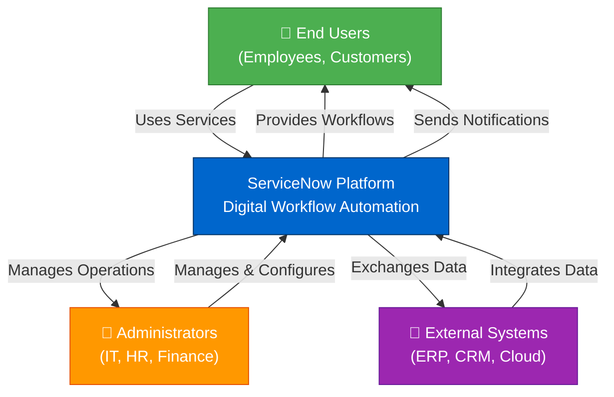

---

## C2: Container Diagram - ServiceNow Platform

```mermaid
graph TB
    subgraph "ServiceNow Platform"
        direction TB
        
        subgraph "User Interfaces"
            Portal["Service Portal<br/>(Customer/Employee)"]
            Workspace["Workspaces<br/>(Agent Interface)"]
            Mobile["Mobile Apps<br/>(iOS/Android)"]
        end
        
        subgraph "Core Platform"
            WFE["Workflow Engine<br/>(Process Automation)"]
            CMDB["CMDB<br/>(Configuration Data)"]
            IRE["Identification &<br/>Reconciliation Engine"]
            Discovery["Discovery Engine<br/>(Auto CI Detection)"]
        end
        
        subgraph "Application Modules"
            ITSM["ITSM<br/>(Incident, Change, Problem)"]
            ITOM["ITOM<br/>(Operations, Monitoring)"]
            CSM["CSM<br/>(Customer Service)"]
            HRSD["HRSD<br/>(HR Service Delivery)"]
            FSM["FSM<br/>(Field Service)"]
            GRC["GRC<br/>(Governance, Risk)"]
            PPM["PPM<br/>(Project Portfolio)"]
            Finance["Finance & Supply Chain"]
        end
        
        subgraph "Platform Services"
            Auth["Authentication<br/>(SSO, SAML)"]
            Integration["Integration Platform<br/>(APIs, IntegrationHub)"]
            Analytics["Performance Analytics<br/>(Reporting, Dashboards)"]
            Security["Security & Compliance<br/>(Encryption, Audit)"]
        end
        
        subgraph "Data & Storage"
            Database["Database<br/>(PostgreSQL/MySQL)"]
            Cache["Cache Layer<br/>(Redis)"]
            Storage["File Storage<br/>(Attachments)"]
        end
        
        Portal --> WFE
        Workspace --> WFE
        Mobile --> WFE
        
        WFE --> CMDB
        CMDB --> IRE
        Discovery --> CMDB
        
        ITSM --> CMDB
        ITOM --> CMDB
        CSM --> CMDB
        HRSD --> CMDB
        FSM --> CMDB
        GRC --> CMDB
        PPM --> CMDB
        Finance --> CMDB
        
        ITSM --> WFE
        ITOM --> WFE
        CSM --> WFE
        HRSD --> WFE
        FSM --> WFE
        
        Auth --> Portal
        Auth --> Workspace
        Integration --> WFE
        Analytics --> ITSM
        Analytics --> ITOM
        Security --> Database
        
        Database --> CMDB
        Cache --> WFE
        Storage --> Portal
    end
    
    style Portal fill:#2196F3,stroke:#1565C0,color:#fff
    style Workspace fill:#2196F3,stroke:#1565C0,color:#fff
    style Mobile fill:#2196F3,stroke:#1565C0,color:#fff
    
    style WFE fill:#FF6B6B,stroke:#C92A2A,color:#fff
    style CMDB fill:#FF6B6B,stroke:#C92A2A,color:#fff
    style IRE fill:#FF6B6B,stroke:#C92A2A,color:#fff
    style Discovery fill:#FF6B6B,stroke:#C92A2A,color:#fff
    
    style ITSM fill:#4CAF50,stroke:#2E7D32,color:#fff
    style ITOM fill:#4CAF50,stroke:#2E7D32,color:#fff
    style CSM fill:#4CAF50,stroke:#2E7D32,color:#fff
    style HRSD fill:#4CAF50,stroke:#2E7D32,color:#fff
    style FSM fill:#4CAF50,stroke:#2E7D32,color:#fff
    style GRC fill:#4CAF50,stroke:#2E7D32,color:#fff
    style PPM fill:#4CAF50,stroke:#2E7D32,color:#fff
    style Finance fill:#4CAF50,stroke:#2E7D32,color:#fff
    
    style Auth fill:#FFC107,stroke:#F57F17,color:#000
    style Integration fill:#FFC107,stroke:#F57F17,color:#000
    style Analytics fill:#FFC107,stroke:#F57F17,color:#000
    style Security fill:#FFC107,stroke:#F57F17,color:#000
    
    style Database fill:#9C27B0,stroke:#6A1B9A,color:#fff
    style Cache fill:#9C27B0,stroke:#6A1B9A,color:#fff
    style Storage fill:#9C27B0,stroke:#6A1B9A,color:#fff
```

---

## C3: Component Diagram - ITSM Module

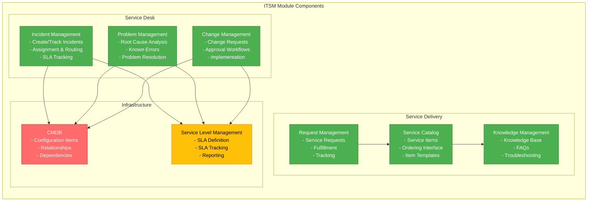

---

## C3: Component Diagram - ITOM Module

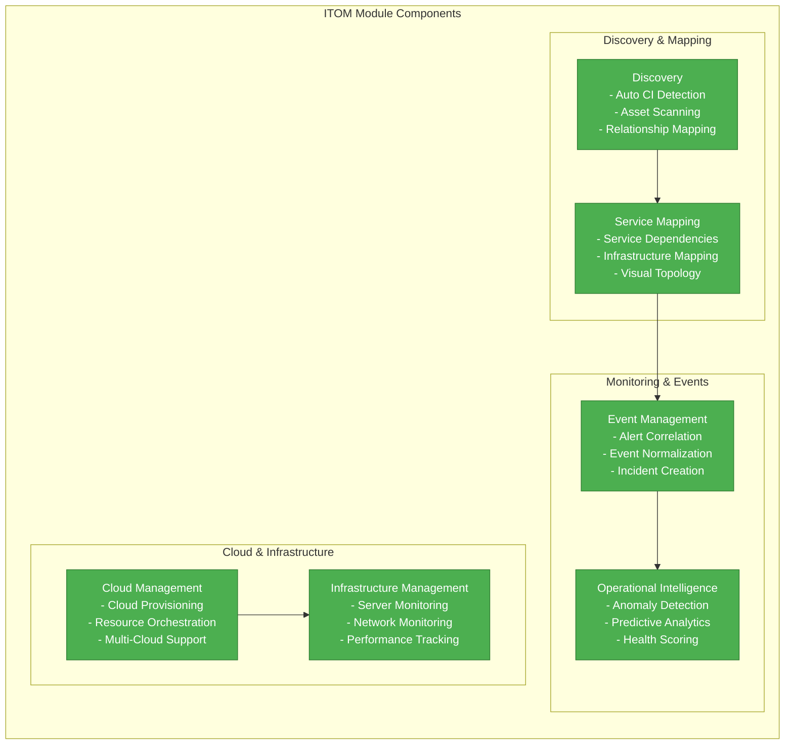

---

## C3: Component Diagram - CSM Module

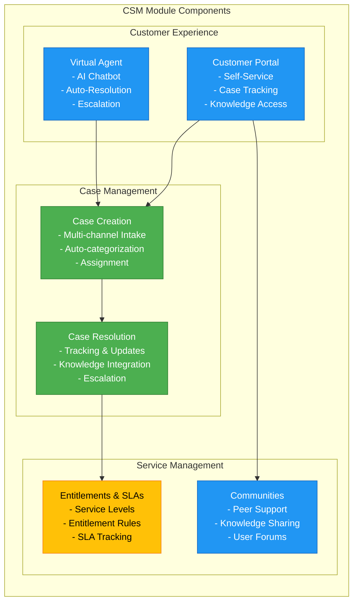

---

## C3: Component Diagram - Workflow Engine

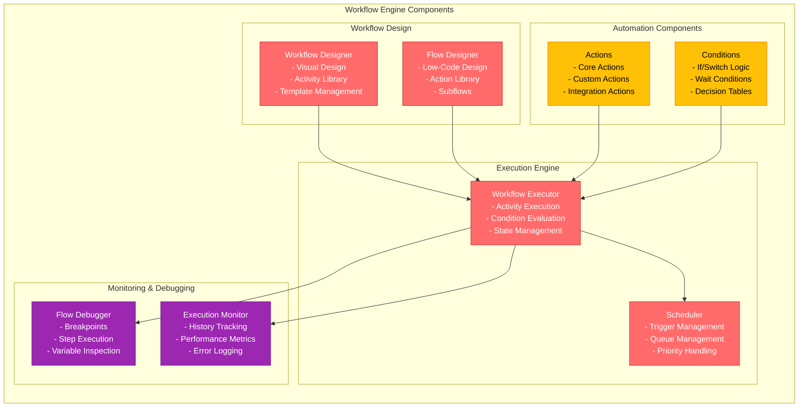

---

## C3: Component Diagram - CMDB

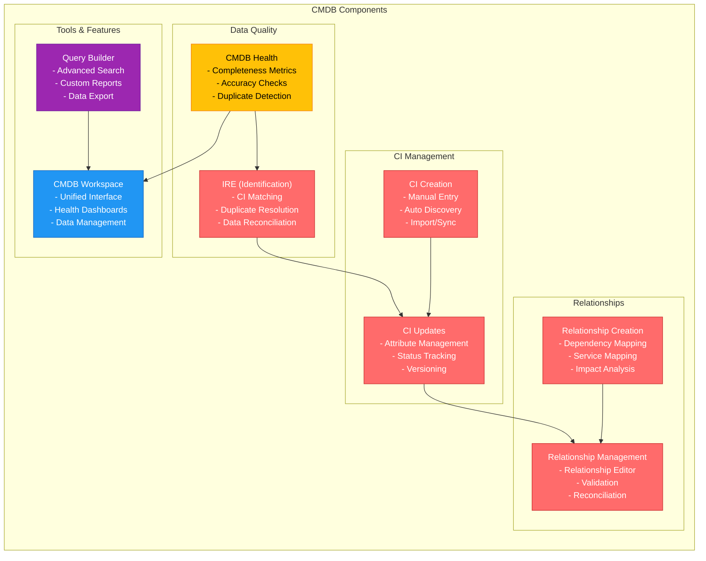

---

## C2: Deployment Diagram - Multi-Tenant Architecture

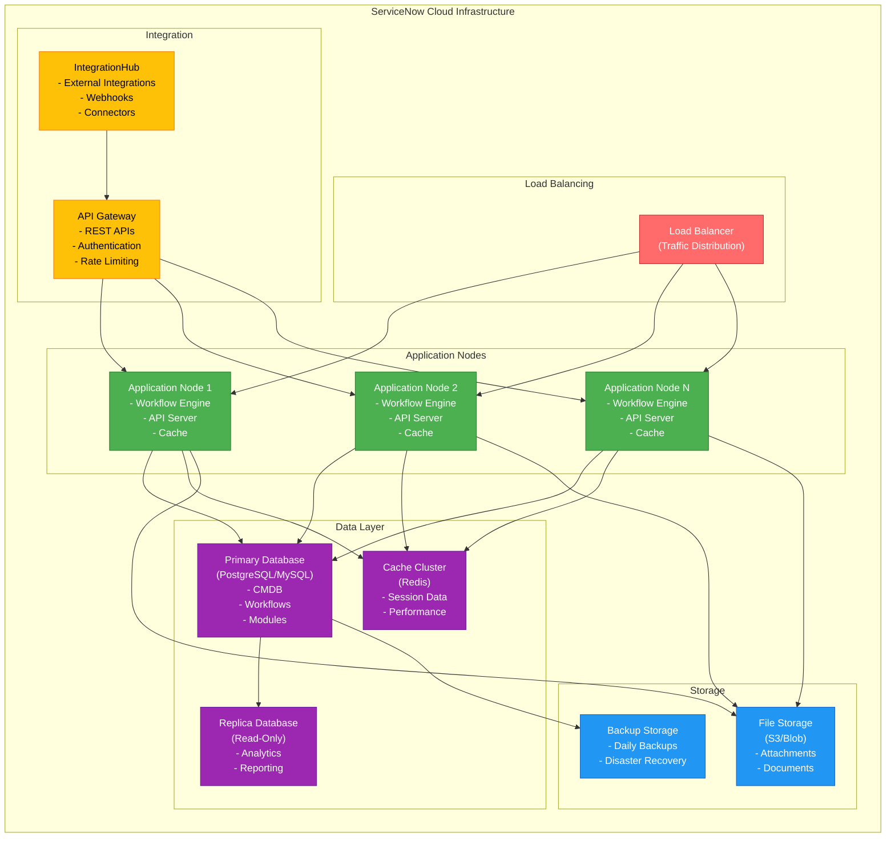

---

## C3: Data Flow Diagram - Incident Management Process

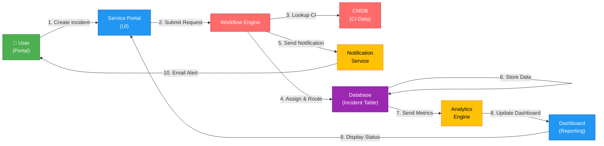

---

## C3: Data Flow Diagram - Change Management Process

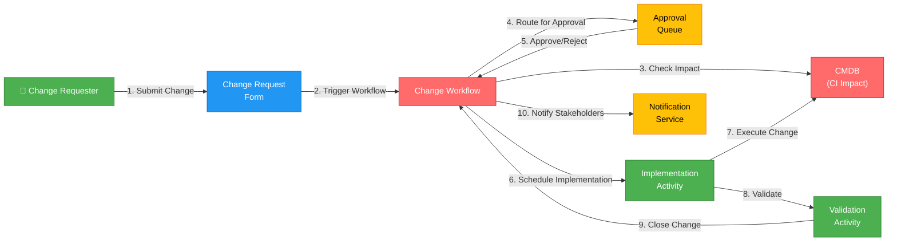

---

## C3: Data Flow Diagram - Discovery & CMDB Population

```mermaid
graph LR
    Scanner["Discovery<br/>Scanner"]
    Network["Network<br/>Scan"]
    Agents["Discovery<br/>Agents"]
    RawData["Raw CI<br/>Data"]
    IRE_Process["IRE<br/>(Identification &<br/>Reconciliation)"]
    Matching["CI Matching<br/>& Deduplication"]
    CMDB_Populate["CMDB<br/>Population"]
    Relationships["Relationship<br/>Creation"]
    Health["Health<br/>Check"]
    
    Scanner -->|"1. Scan Network"| Network
    Agents -->|"2. Collect Data"| RawData
    Network -->|"3. Send Data"| RawData
    RawData -->|"4. Process"| IRE_Process
    IRE_Process -->|"5. Match CIs"| Matching
    Matching -->|"6. Deduplicate"| CMDB_Populate
    CMDB_Populate -->|"7. Store CIs"| CMDB_Populate
    CMDB_Populate -->|"8. Create Relationships"| Relationships
    Relationships -->|"9. Validate"| Health
    Health -->|"10. Update Health Score"| CMDB_Populate
    
    style Scanner fill:#4CAF50,stroke:#2E7D32,color:#fff
    style Network fill:#4CAF50,stroke:#2E7D32,color:#fff
    style Agents fill:#4CAF50,stroke:#2E7D32,color:#fff
    style RawData fill:#9C27B0,stroke:#6A1B9A,color:#fff
    style IRE_Process fill:#FF6B6B,stroke:#C92A2A,color:#fff
    style Matching fill:#FF6B6B,stroke:#C92A2A,color:#fff
    style CMDB_Populate fill:#FF6B6B,stroke:#C92A2A,color:#fff
    style Relationships fill:#FF6B6B,stroke:#C92A2A,color:#fff
    style Health fill:#FFC107,stroke:#F57F17,color:#000
```

---

## Integration Architecture Diagram

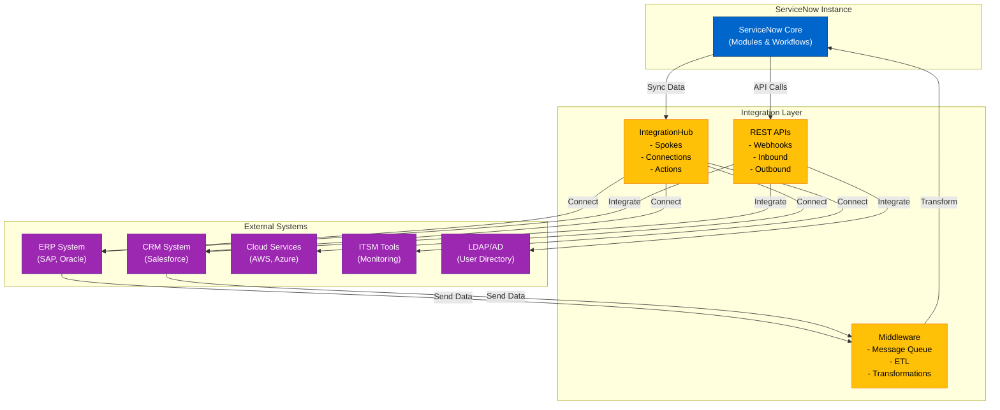

---

## Module Interaction Diagram

```mermaid
graph TB
    CMDB["CMDB<br/>(Central Repository)"]
    
    ITSM["ITSM<br/>(Incident, Change,<br/>Problem)"]
    ITOM["ITOM<br/>(Operations,<br/>Monitoring)"]
    ITAM["ITAM<br/>(Asset<br/>Management)"]
    CSM["CSM<br/>(Customer<br/>Service)"]
    HRSD["HRSD<br/>(HR Service<br/>Delivery)"]
    FSM["FSM<br/>(Field<br/>Service)"]
    GRC["GRC<br/>(Governance,<br/>Risk)"]
    PPM["PPM<br/>(Project<br/>Portfolio)"]
    Finance["Finance &<br/>Supply Chain"]
    
    WFE["Workflow Engine<br/>(Orchestration)"]
    Analytics["Analytics<br/>(Reporting)"]
    
    ITSM -->|"Uses"| CMDB
    ITOM -->|"Uses"| CMDB
    ITAM -->|"Uses"| CMDB
    CSM -->|"Uses"| CMDB
    HRSD -->|"Uses"| CMDB
    FSM -->|"Uses"| CMDB
    GRC -->|"Uses"| CMDB
    PPM -->|"Uses"| CMDB
    Finance -->|"Uses"| CMDB
    
    ITSM -->|"Orchestrates"| WFE
    ITOM -->|"Orchestrates"| WFE
    CSM -->|"Orchestrates"| WFE
    HRSD -->|"Orchestrates"| WFE
    FSM -->|"Orchestrates"| WFE
    
    ITSM -->|"Reports"| Analytics
    ITOM -->|"Reports"| Analytics
    CSM -->|"Reports"| Analytics
    HRSD -->|"Reports"| Analytics
    FSM -->|"Reports"| Analytics
    
    ITOM -->|"Discovers"| CMDB
    ITAM -->|"Tracks"| CMDB
    
    style CMDB fill:#FF6B6B,stroke:#C92A2A,color:#fff,stroke-width:3px
    style WFE fill:#FF6B6B,stroke:#C92A2A,color:#fff,stroke-width:3px
    style Analytics fill:#FFC107,stroke:#F57F17,color:#000,stroke-width:2px
    
    style ITSM fill:#4CAF50,stroke:#2E7D32,color:#fff
    style ITOM fill:#4CAF50,stroke:#2E7D32,color:#fff
    style ITAM fill:#4CAF50,stroke:#2E7D32,color:#fff
    style CSM fill:#4CAF50,stroke:#2E7D32,color:#fff
    style HRSD fill:#4CAF50,stroke:#2E7D32,color:#fff
    style FSM fill:#4CAF50,stroke:#2E7D32,color:#fff
    style GRC fill:#4CAF50,stroke:#2E7D32,color:#fff
    style PPM fill:#4CAF50,stroke:#2E7D32,color:#fff
    style Finance fill:#4CAF50,stroke:#2E7D32,color:#fff
```

---

## Legend

### Color Coding
- **Red (#FF6B6B)** – Core Platform Components (CMDB, Workflow Engine)
- **Green (#4CAF50)** – Application Modules
- **Blue (#2196F3)** – User Interfaces & Portals
- **Yellow (#FFC107)** – Platform Services & Integration
- **Purple (#9C27B0)** – Data & Storage Layer

### Diagram Types
- **C1 (Context)** – System boundaries and external actors
- **C2 (Container)** – Major components and their interactions
- **C3 (Component)** – Internal structure of containers
- **C4 (Code)** – Detailed implementation (not shown here)
- **Data Flow** – How data moves through the system
- **Deployment** – Infrastructure and deployment topology

---

## Key Architectural Principles

### 1. Centralized Data Model
- CMDB serves as single source of truth
- All modules reference CMDB data
- Ensures data consistency across platform

### 2. Workflow-Driven Automation
- Workflow Engine orchestrates all processes
- Enables complex multi-step automation
- Supports approvals, notifications, and integrations

### 3. Multi-Tenant Architecture
- Isolated instances for each organization
- Shared infrastructure for cost efficiency
- Separate databases and security contexts

### 4. API-First Design
- RESTful APIs for all functionality
- Enables integrations and extensions
- Supports mobile and web clients

### 5. Scalability & Performance
- Load balancing across multiple nodes
- Caching layer for performance
- Database replication for read scaling
- Asynchronous processing for long-running tasks

### 6. Security & Compliance
- Role-based access control (RBAC)
- Encryption at rest and in transit
- Audit trails for compliance
- Multi-factor authentication support

---

## Conclusion

These C4 architecture diagrams provide a comprehensive view of ServiceNow's platform structure, from system context through detailed component interactions. The diagrams illustrate how the CMDB and Workflow Engine serve as the foundation for all ServiceNow modules, enabling organizations to automate and manage their entire digital workflow ecosystem.
