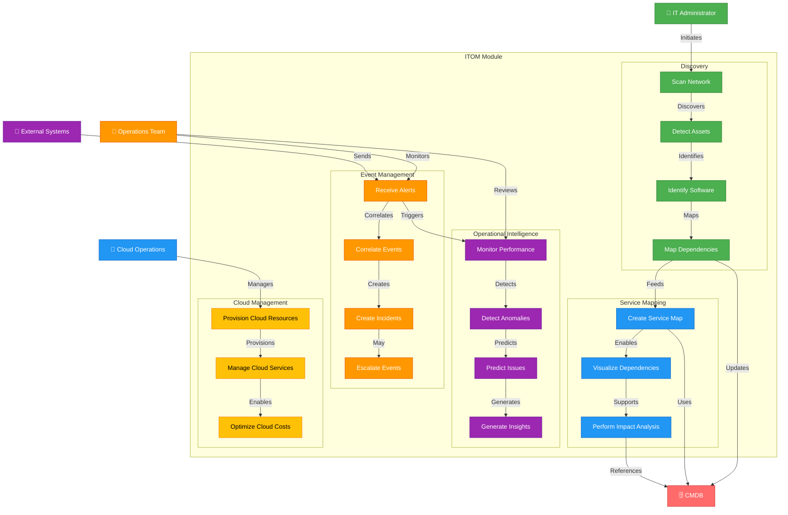
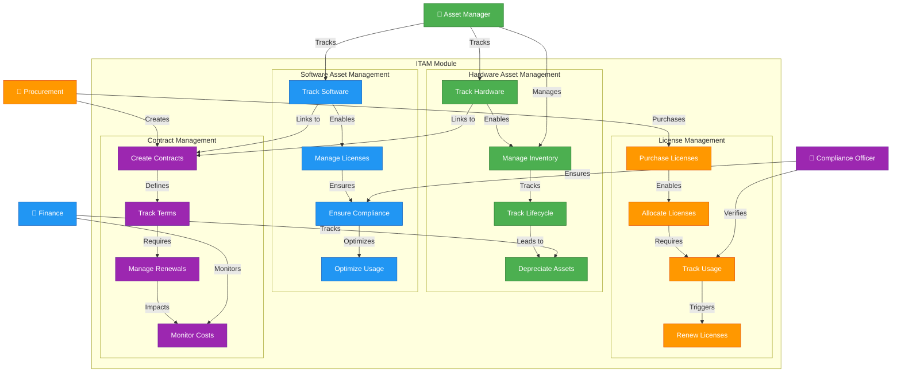
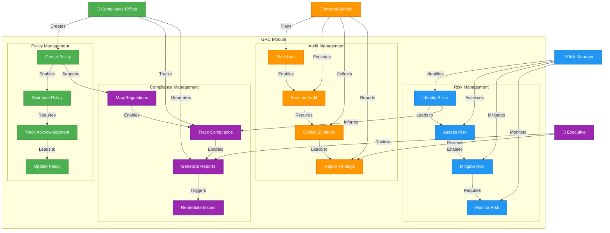
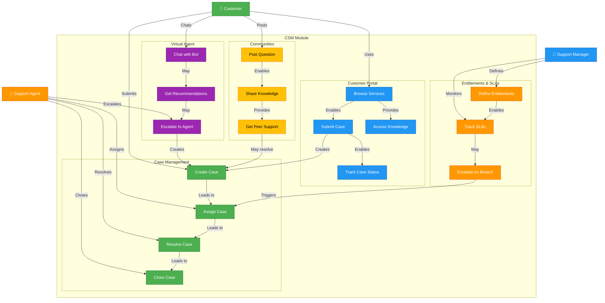
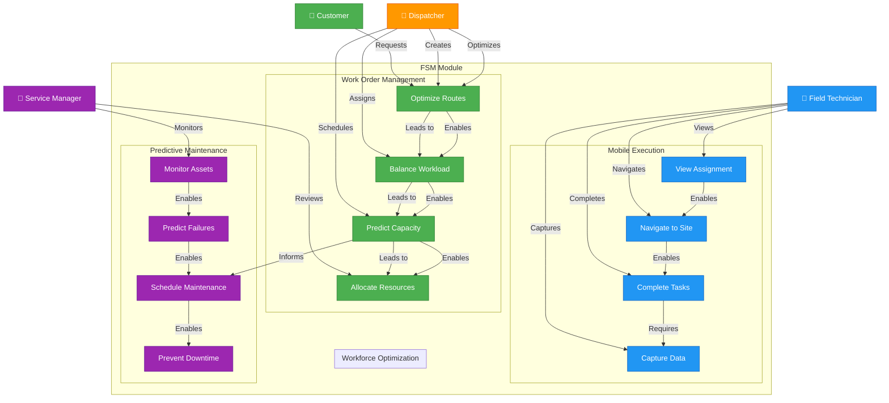
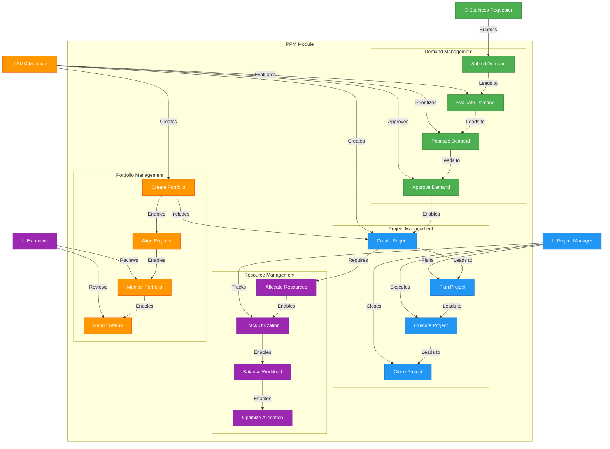
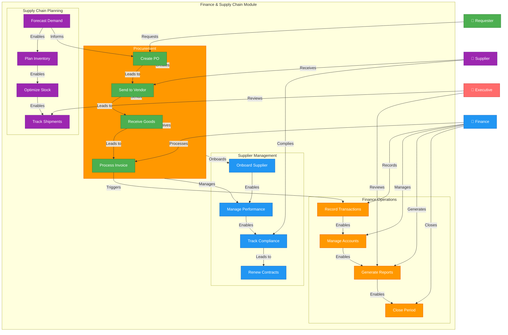
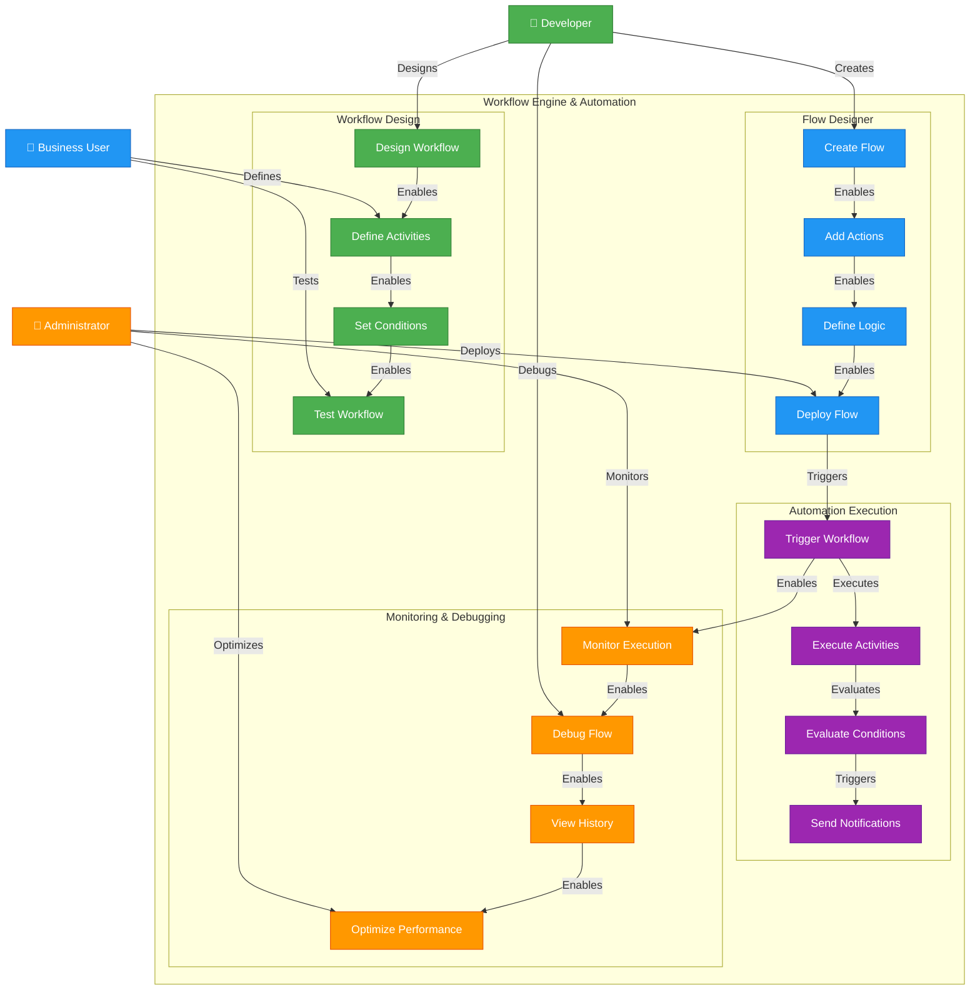

# ServiceNow Modules - Use Case Diagrams

## Overview
This document contains Mermaid use case diagrams for all ServiceNow modules, illustrating the key actors, use cases, and interactions for each module.

---

## 1. ITSM (IT Service Management) - Use Case Diagram

```mermaid
graph TB
    subgraph "ITSM Module"
        direction TB
        
        subgraph "Incident Management"
            UC_IM1["Create Incident"]
            UC_IM2["Assign Incident"]
            UC_IM3["Resolve Incident"]
            UC_IM4["Track SLA"]
            UC_IM5["Escalate Incident"]
        end
        
        subgraph "Problem Management"
            UC_PM1["Report Problem"]
            UC_PM2["Analyze Root Cause"]
            UC_PM3["Create Known Error"]
            UC_PM4["Resolve Problem"]
        end
        
        subgraph "Change Management"
            UC_CM1["Submit Change Request"]
            UC_CM2["Assess Impact"]
            UC_CM3["Approve Change"]
            UC_CM4["Implement Change"]
            UC_CM5["Validate Change"]
        end
        
        subgraph "Request Management"
            UC_RM1["Submit Service Request"]
            UC_RM2["Fulfill Request"]
            UC_RM3["Track Fulfillment"]
        end
        
        subgraph "Service Catalog"
            UC_SC1["Browse Services"]
            UC_SC2["Order Service"]
            UC_SC3["Configure Service"]
        end
        
        subgraph "Knowledge Management"
            UC_KM1["Create Article"]
            UC_KM2["Search Knowledge"]
            UC_KM3["Use Self-Service"]
        end
    end
    
    User["👤 End User"]
    Agent["👤 Service Desk Agent"]
    Manager["👤 Manager"]
    CMDB_Actor["🗄️ CMDB"]
    
    User -->|"Creates"| UC_IM1
    User -->|"Submits"| UC_RM1
    User -->|"Browses"| UC_SC1
    User -->|"Searches"| UC_KM2
    
    Agent -->|"Assigns"| UC_IM2
    Agent -->|"Resolves"| UC_IM3
    Agent -->|"Analyzes"| UC_PM2
    Agent -->|"Fulfills"| UC_RM2
    
    Manager -->|"Approves"| UC_CM3
    Manager -->|"Reviews"| UC_IM4
    
    UC_IM1 -->|"Triggers"| UC_IM2
    UC_IM2 -->|"Leads to"| UC_IM3
    UC_IM3 -->|"Checks"| UC_IM4
    UC_IM2 -->|"May need"| UC_IM5
    
    UC_IM3 -->|"References"| UC_KM2
    UC_CM1 -->|"Checks"| UC_CM2
    UC_CM2 -->|"Routes to"| UC_CM3
    UC_CM3 -->|"Enables"| UC_CM4
    UC_CM4 -->|"Requires"| UC_CM5
    
    UC_SC1 -->|"Leads to"| UC_SC2
    UC_SC2 -->|"Creates"| UC_RM1
    
    UC_CM4 -->|"Updates"| CMDB_Actor
    UC_IM3 -->|"Updates"| CMDB_Actor
    
    style UC_IM1 fill:#4CAF50,stroke:#2E7D32,color:#fff
    style UC_IM2 fill:#4CAF50,stroke:#2E7D32,color:#fff
    style UC_IM3 fill:#4CAF50,stroke:#2E7D32,color:#fff
    style UC_IM4 fill:#4CAF50,stroke:#2E7D32,color:#fff
    style UC_IM5 fill:#4CAF50,stroke:#2E7D32,color:#fff
    
    style UC_PM1 fill:#4CAF50,stroke:#2E7D32,color:#fff
    style UC_PM2 fill:#4CAF50,stroke:#2E7D32,color:#fff
    style UC_PM3 fill:#4CAF50,stroke:#2E7D32,color:#fff
    style UC_PM4 fill:#4CAF50,stroke:#2E7D32,color:#fff
    
    style UC_CM1 fill:#FF9800,stroke:#E65100,color:#fff
    style UC_CM2 fill:#FF9800,stroke:#E65100,color:#fff
    style UC_CM3 fill:#FF9800,stroke:#E65100,color:#fff
    style UC_CM4 fill:#FF9800,stroke:#E65100,color:#fff
    style UC_CM5 fill:#FF9800,stroke:#E65100,color:#fff
    
    style UC_RM1 fill:#2196F3,stroke:#1565C0,color:#fff
    style UC_RM2 fill:#2196F3,stroke:#1565C0,color:#fff
    style UC_RM3 fill:#2196F3,stroke:#1565C0,color:#fff
    
    style UC_SC1 fill:#9C27B0,stroke:#6A1B9A,color:#fff
    style UC_SC2 fill:#9C27B0,stroke:#6A1B9A,color:#fff
    style UC_SC3 fill:#9C27B0,stroke:#6A1B9A,color:#fff
    
    style UC_KM1 fill:#FFC107,stroke:#F57F17,color:#000
    style UC_KM2 fill:#FFC107,stroke:#F57F17,color:#000
    style UC_KM3 fill:#FFC107,stroke:#F57F17,color:#000
    
    style User fill:#4CAF50,stroke:#2E7D32,color:#fff
    style Agent fill:#FF9800,stroke:#E65100,color:#fff
    style Manager fill:#2196F3,stroke:#1565C0,color:#fff
    style CMDB_Actor fill:#FF6B6B,stroke:#C92A2A,color:#fff
```

---

## 2. ITOM (IT Operations Management) - Use Case Diagram

---

## 3. ITAM (IT Asset Management) - Use Case Diagram

---

## 4. GRC (Governance, Risk, and Compliance) - Use Case Diagram

---

## 5. CSM (Customer Service Management) - Use Case Diagram

---

## 6. HRSD (HR Service Delivery) - Use Case Diagram

```mermaid
graph TB
    subgraph "HRSD Module"
        direction TB
        
        subgraph "Employee Service Center"
            UC_ESC1["Submit HR Request"]
            UC_ESC2["Track Request"]
            UC_ESC3["Access HR Services"]
            UC_ESC4["View HR Documents"]
        end
        
        subgraph "Onboarding"
            UC_OB1["Create Onboarding Plan"]
            UC_OB2["Assign Tasks"]
            UC_OB3["Track Progress"]
            UC_OB4["Complete Onboarding"]
        end
        
        subgraph "Offboarding"
            UC_OB1["Create Offboarding Plan"]
            UC_OB2["Assign Exit Tasks"]
            UC_OB3["Track Completion"]
            UC_OB4["Archive Employee"]
        end
        
        subgraph "HR Surveys"
            UC_SV1["Create Survey"]
            UC_SV2["Distribute Survey"]
            UC_SV3["Collect Responses"]
            UC_SV4["Analyze Results"]
        end
        
        subgraph "Case Management"
            UC_CM1["Create HR Case"]
            UC_CM2["Route to HR"]
            UC_CM3["Resolve Case"]
            UC_CM4["Close Case"]
        end
    end
    
    Employee["👤 Employee"]
    Manager["👤 Manager"]
    HR["👤 HR Specialist"]
    
    Employee -->|"Submits"| UC_ESC1
    Employee -->|"Tracks"| UC_ESC2
    Employee -->|"Accesses"| UC_ESC3
    Employee -->|"Views"| UC_ESC4
    Employee -->|"Responds"| UC_SV3
    
    Manager -->|"Creates"| UC_OB1
    Manager -->|"Assigns"| UC_OB2
    Manager -->|"Tracks"| UC_OB3
    
    HR -->|"Creates"| UC_CM1
    HR -->|"Routes"| UC_CM2
    HR -->|"Resolves"| UC_CM3
    HR -->|"Closes"| UC_CM4
    HR -->|"Creates"| UC_SV1
    HR -->|"Distributes"| UC_SV2
    HR -->|"Analyzes"| UC_SV4
    
    UC_ESC1 -->|"Enables"| UC_ESC2
    UC_ESC3 -->|"Provides"| UC_ESC4
    
    UC_OB1 -->|"Enables"| UC_OB2
    UC_OB2 -->|"Requires"| UC_OB3
    UC_OB3 -->|"Leads to"| UC_OB4
    
    UC_SV1 -->|"Enables"| UC_SV2
    UC_SV2 -->|"Enables"| UC_SV3
    UC_SV3 -->|"Enables"| UC_SV4
    
    UC_CM1 -->|"Leads to"| UC_CM2
    UC_CM2 -->|"Leads to"| UC_CM3
    UC_CM3 -->|"Leads to"| UC_CM4
    
    style UC_ESC1 fill:#4CAF50,stroke:#2E7D32,color:#fff
    style UC_ESC2 fill:#4CAF50,stroke:#2E7D32,color:#fff
    style UC_ESC3 fill:#4CAF50,stroke:#2E7D32,color:#fff
    style UC_ESC4 fill:#4CAF50,stroke:#2E7D32,color:#fff
    
    style UC_OB1 fill:#2196F3,stroke:#1565C0,color:#fff
    style UC_OB2 fill:#2196F3,stroke:#1565C0,color:#fff
    style UC_OB3 fill:#2196F3,stroke:#1565C0,color:#fff
    style UC_OB4 fill:#2196F3,stroke:#1565C0,color:#fff
    
    style UC_SV1 fill:#9C27B0,stroke:#6A1B9A,color:#fff
    style UC_SV2 fill:#9C27B0,stroke:#6A1B9A,color:#fff
    style UC_SV3 fill:#9C27B0,stroke:#6A1B9A,color:#fff
    style UC_SV4 fill:#9C27B0,stroke:#6A1B9A,color:#fff
    
    style UC_CM1 fill:#FF9800,stroke:#E65100,color:#fff
    style UC_CM2 fill:#FF9800,stroke:#E65100,color:#fff
    style UC_CM3 fill:#FF9800,stroke:#E65100,color:#fff
    style UC_CM4 fill:#FF9800,stroke:#E65100,color:#fff
    
    style Employee fill:#4CAF50,stroke:#2E7D32,color:#fff
    style Manager fill:#2196F3,stroke:#1565C0,color:#fff
    style HR fill:#FF9800,stroke:#E65100,color:#fff
```

---

## 7. FSM (Field Service Management) - Use Case Diagram

---

## 8. PPM (Project Portfolio Management) - Use Case Diagram

---

## 9. Finance & Supply Chain - Use Case Diagram

---

## 10. Workflow Engine & Automation - Use Case Diagram

---

## Summary of Use Cases by Module

| Module | Primary Actors | Key Use Cases | Primary Benefits |
|--------|---|---|---|
| **ITSM** | End Users, Agents, Managers | Incident, Problem, Change, Request Management | Faster resolution, Better service quality |
| **ITOM** | Admins, Operations Team | Discovery, Monitoring, Event Management | Proactive issue detection, Infrastructure visibility |
| **ITAM** | Asset Managers, Finance, Compliance | Asset Tracking, License Management, Compliance | Cost optimization, Compliance assurance |
| **GRC** | Compliance, Risk, Auditors | Policy, Risk, Audit, Compliance Management | Regulatory compliance, Risk mitigation |
| **CSM** | Customers, Agents, Managers | Case Management, Portal, Virtual Agent | Customer satisfaction, Self-service |
| **HRSD** | Employees, HR, Managers | Onboarding, Offboarding, HR Services | Employee experience, Efficiency |
| **FSM** | Customers, Dispatchers, Technicians | Work Orders, Mobile Execution, Optimization | First-time fix, Resource optimization |
| **PPM** | Requesters, PMO, Executives | Demand, Project, Portfolio Management | Strategic alignment, Resource optimization |
| **Finance & Supply Chain** | Procurement, Finance, Suppliers | Procurement, Supplier, Finance Management | Cost reduction, Supply chain visibility |
| **Workflow Engine** | Developers, Business Users, Admins | Design, Execution, Monitoring | Process automation, Efficiency |

---

## Color Legend

- **Green (#4CAF50)** – Primary/Core Use Cases
- **Blue (#2196F3)** – Secondary/Support Use Cases
- **Purple (#9C27B0)** – Advanced/Specialized Use Cases
- **Orange (#FF9800)** – Management/Administrative Use Cases
- **Yellow (#FFC107)** – Collaborative/Community Use Cases

---

## Conclusion

These use case diagrams provide a comprehensive view of the key actors, use cases, and interactions for each ServiceNow module. They illustrate how different user roles interact with each module to achieve business objectives and deliver value across the organization.
